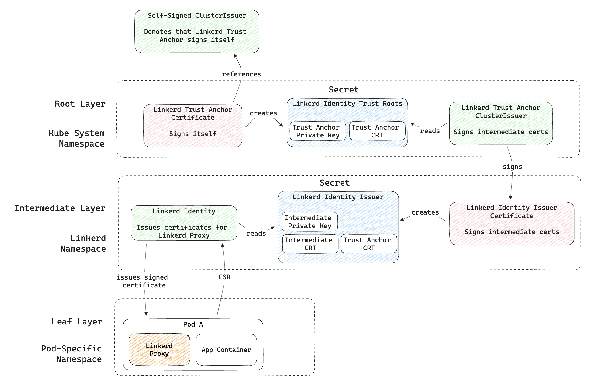

# Automating-Linkerd-Intermediate-Certificate-Rotations

## Content
This repository holds all source code related to the Bachelor thesis titled "Automating Linkerd Issuer Certificate Rotations on Giant Swarm Clusters". Rolls right off the tongue. The point is, as the title suggests, to set up the PKI needed for automatic certificate management regarding Linkerd. At the moment of writing the thesis, Linkerd is being set up for production on GS clusters and is currently a work in progress. As part of this progress, this thesis implements the certificate management aspects.

## Task
The objective of this project is to establish an environment on a Giant Swarm AWS cluster that ensures the automatic rotation of Linkerd intermediate certificates. As this task can be regarded as a system integration, it is crucial to find a solution that fits into the existing infrastructure. For this reason, we are bootstrapping a PKI using cert-manager resources as cert-manager is a default app on target clusters.

## Design
First and foremost, it is essential to recognize the various layers and thus the certificate chain. A layer is needed for the root components, and another layer is required for the components of the intermediate layer.

Generally, within a layer of the certificate chain, three components can be found: a cert-manager `Certificate Resource` (red), a `secret` (blue), and a cert-manager `ClusterIssuer` (green). The Certificate Resource represents the certificate, as the name suggests, and generates the necessary credentials, storing them in a predefined Kubernetes secret. A ClusterIssuer can access this secret to sign requested certificates.

These three components are found both in the root layer and the intermediate layer. From top to bottom, the certificate, the secret, and the ClusterIssuer work together as such:

To build a CA using cert-manager, a `self-signed ClusterIssuer` takes precedence. This self-signed ClusterIssuer does not serve as the CA itself but denotes another certificate as self-signed. This self-signed certificate is the root certificate, namely the `Linkerd Trust Anchor Certificate`. The root certificate generates the root credentials and stores them in the secret `Linkerd Identity Trust Roots`. The ClusterIssuer, namely `Linkerd Trust Anchor ClusterIssuer`, acts as the root CA. Linkerd Trust Anchor ClusterIssuer utilizes the credentials stored in the secret to sign the `Linkerd Identity Issuer Certificate`. This issuer certificate can also be called the intermediate certificate.

As previously mentioned, the responsibility of creating credentials and storing them in a secret lies with the cert-manager Certificate Resource. The intermediate certificate (Linkerd Identity Issuer Certificate) stores the intermediate credentials in a secret in its namespace. These tools are essential for the intermediate CA to validate and sign certificates. It is important to note that the secret bears the name `Linkerd Identity Issuer`. This is because it is a Linkerd-native resource that acts as the intermediate CA. Thus, there is no need to create another cert-manager ClusterIssuer and the rest of the implementation is connected to Linkerd at this point. It lies in Linkerd's implementation that Linkerd Identity retrieves the intermediate credentials from a secret named Linkerd Identity Issuer.

And so Linkerd Identity serves as the CA responsible for processing and signing all the CSRs provided by the injected Linkerd proxies.

## CRDs

The above explained design is implemented using CRDs. For quick viewing:

The source code concerning the creation of the **Root CA** can be found in [cluster-issuer.yaml](cluster-issuer.yaml). 
The source code concerning the creation of the **Issuer CA** can be found in [identity-issuer.yaml](identity-issuer.yaml). 
The source code concerning the installation of **Linkerd** can be found in [app-manifest.yaml](app-manifest.yaml).

## Further Reading
- [Cert-manager Issuers](https://cert-manager.io/docs/concepts/issuer/)
- [Cert-manager Certificate Resources](https://cert-manager.io/docs/usage/certificate/)
- [Giant Swarm App CRs](https://docs.giantswarm.io/getting-started/app-platform/app-configuration/) (relevant to [app-manifest.yaml](app-manifest.yaml))
- [Linkerd](https://linkerd.io/what-is-a-service-mesh/)
- [Linkerd Architecture](https://linkerd.io/2.14/reference/architecture/)
